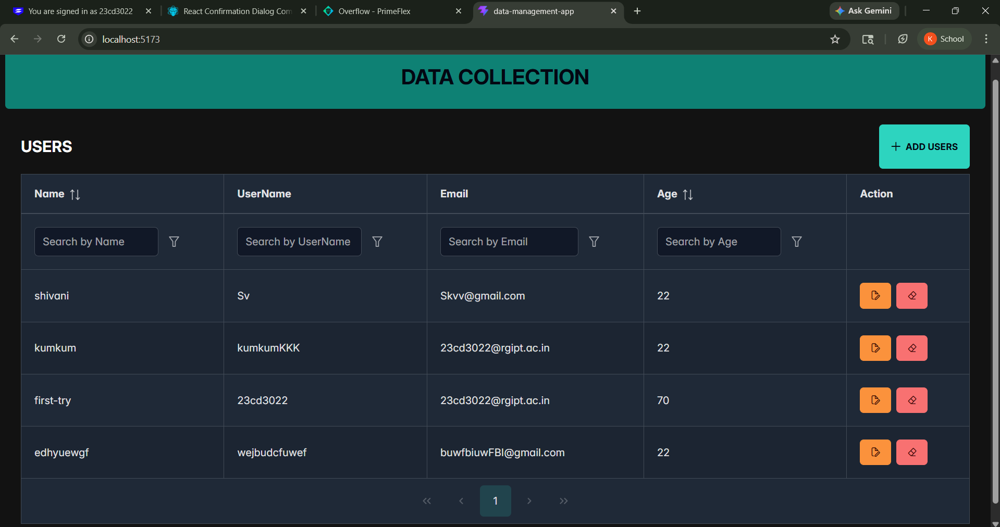
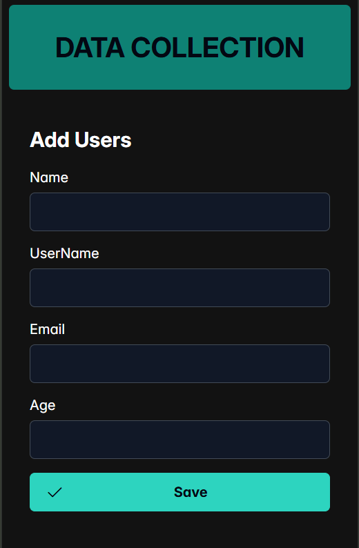
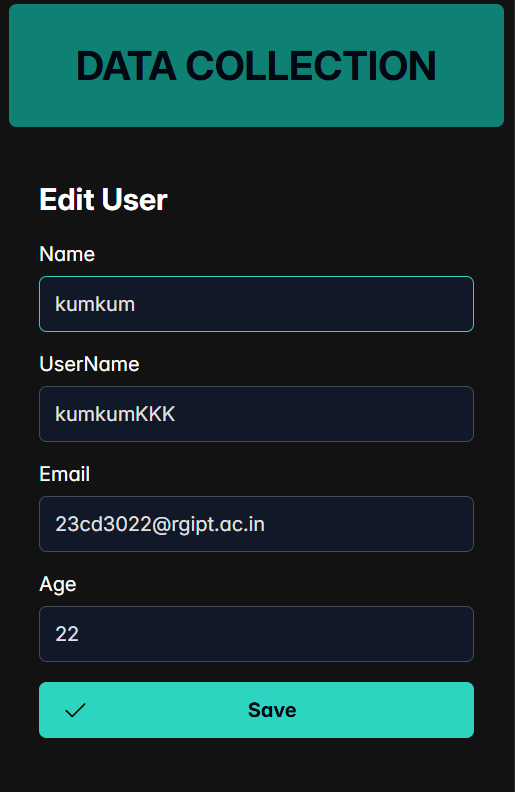
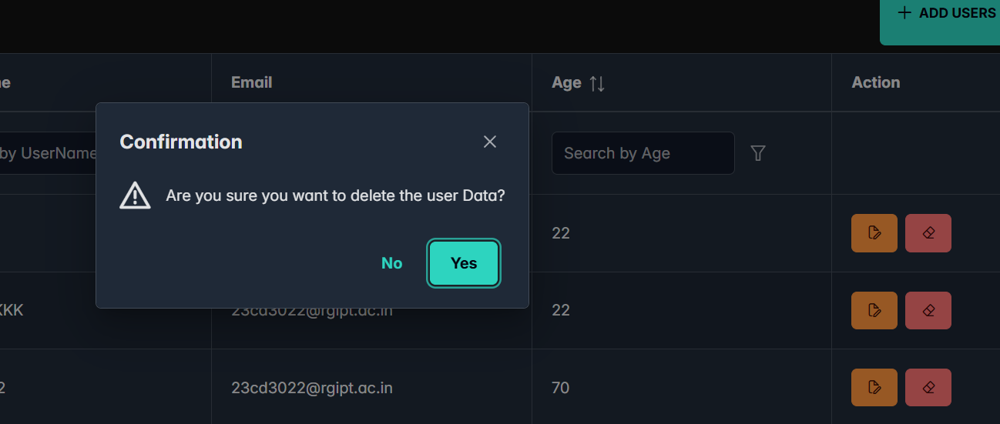
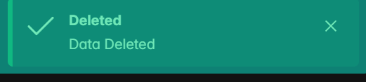

#  React CRUD App (JSON Server + Axios + PrimeReact)

This is a CRUD (Create, Read, Update, Delete) application built using React.
This is a simple CRUD application I built using React to understand how frontend apps interact with APIs.
Instead of a real backend, I used JSON Server to simulate REST APIs and focused more on frontend logic, API handling, and UI experience.

---

##  What this project does - Features

* Add new records
* View data in a structured table
* Update existing entries
* Delete records with confirmation
* Form validation before submitting
* Toast notifications for user feedback

The goal was to build something close to a real-world app flow, even with a mock backend.

---

##  Tech Stack

* **React.js** – Frontend
* **Axios** – API handling
* **JSON Server** – Mock backend (REST API)
* **PrimeReact** – UI components (DataTable, Toast, ConfirmDialog)
* **React Router** – Navigation
* **React Hook Form + Yup** – Form handling & validation

---

## ⚙️ How to run this project locally

If you want to try this project on your system, follow these steps:

### 1. Clone the repository

```bash
git clone https://github.com/your-username/your-repo-name.git
cd your-repo-name
```

---

### 2. Install dependencies

```bash
npm install
```

---

### 3. Start JSON Server (Mock Backend)

If you don’t have JSON Server installed:

```bash
npm install -g json-server
```

Now run:

```bash
json-server --watch db.json --port 3000
```

This will start the API at:
[http://localhost:3000](http://localhost:3000)

---

### 4. Start the React app

Open a new terminal and run:

```bash
npm start
```

App will run at:
[http://localhost:3001](http://localhost:3001) (or next available port)

---

## 🔗 API Endpoints

| Method | Endpoint   | Description    |
| ------ | ---------- | -------------- |
| GET    | /users     | Fetch all data |
| POST   | /users     | Add new data   |
| PUT    | /users/:id | Update data    |
| DELETE | /users/:id | Delete data    |

---

##  Screenshots

I’ve added some screenshots to show the UI and flow of the app:







---

##  Why JSON Server?

I used JSON Server to quickly simulate a backend so I could focus on:

* API integration
* UI/UX
* Form handling & validation

The app is structured in a way that it can be easily connected to a real backend later (Node.js / Express).

---

##  Future Scope

This project is currently using JSON Server as a mock backend, but I am actively working on extending it into a full-stack application.

Planned improvements include:

*  Implement authentication (JWT-based login/signup)
*  Replace JSON Server with a real backend using Node.js and Express
*  Integrate a database (MongoDB) for persistent storage
*  Improve error handling and API response management
*  Add search, filtering, and pagination in DataTable
*  Deploy frontend and backend separately (e.g., Vercel + Render)

The frontend is already structured in a way that makes it easy to switch from a mock API to a real backend with minimal changes.

---

##  Contributing

If you’d like to improve something, feel free to fork the repo and create a PR.

---

## 📄 License

MIT License

Copyright (c) 2026

Permission is hereby granted, free of charge, to any person obtaining a copy
of this software and associated documentation files to deal in the Software
without restriction...
